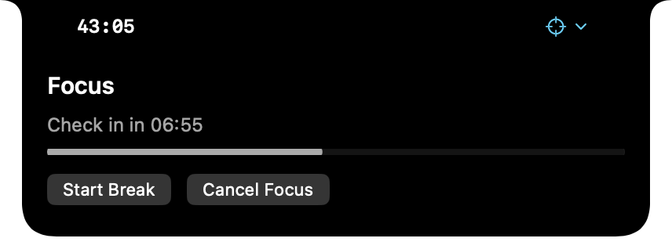
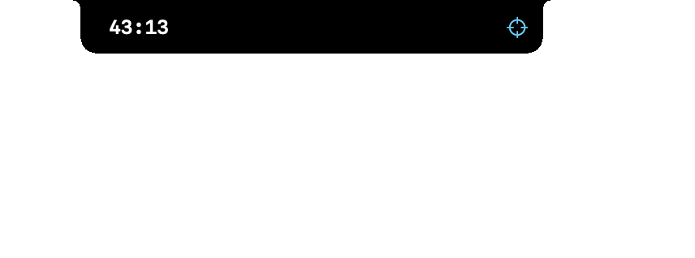
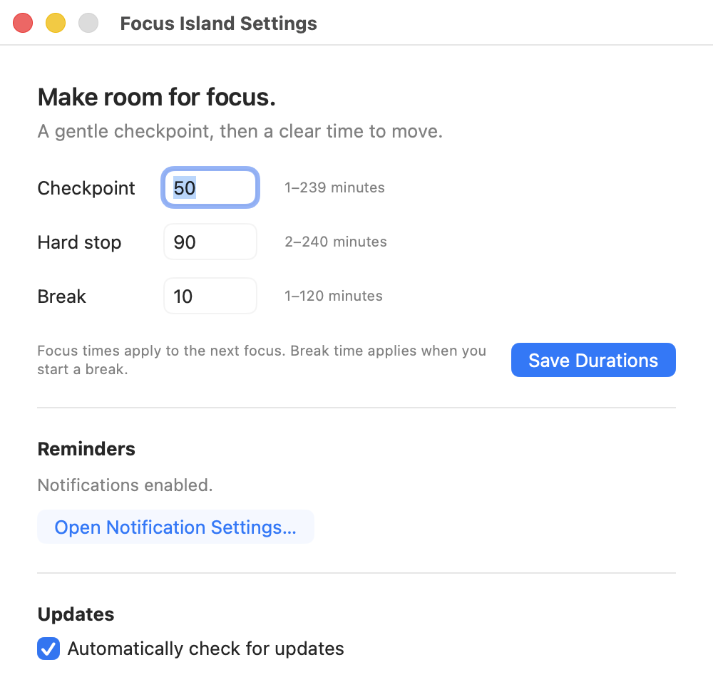

# Focus Island

[](https://github.com/zeapsu/FocusIsland/actions/workflows/ci.yml)
[](https://github.com/zeapsu/FocusIsland/releases/latest)
[](https://www.apple.com/macos/)
[](https://www.swift.org/)
[](LICENSE)

A small, native macOS focus timer that lives in the menu bar and grows out of the MacBook notch when you need it. It asks at a checkpoint without stopping your work, prompts you to move at the hard stop, and times the break that follows.

<p align="center"></p>

<p align="center"></p>

## What it does

- Starts a focus block with a 50-minute awareness checkpoint, a 90-minute hard stop, and a 10-minute break by default.
- Keeps the timer accurate across sleep, display sleep, and ordinary relaunches by persisting absolute deadlines instead of counting ticks.
- Uses one shared session model for the menu bar, notch island, Settings, and notifications.
- Expands from the notch into a small control surface on hover. The camera cutout stays clear, and the shell folds back after the pointer leaves.
- Offers System, Solarized Light, and Solarized Dark appearances.
- Uses native notifications when allowed; declining permission never prevents the timer from working.

<p align="center"></p>

## Install

Download the [latest release](https://github.com/zeapsu/FocusIsland/releases/latest), move **Focus Island.app** to Applications if you like, and open it.

The initial downloadable builds are ad-hoc signed. If macOS blocks the first launch, first try to open the app normally and dismiss the warning. Then open **Apple menu → System Settings → Privacy & Security**, scroll to **Security**, click **Open** for Focus Island, then click **Open Anyway** and authenticate. Apple makes this exception available for about an hour after the blocked launch. Do not disable Gatekeeper system-wide. Developer ID signing and notarization are planned before broad distribution. See Apple’s [unknown-developer app guidance](https://support.apple.com/guide/mac-help/open-a-mac-app-from-an-unknown-developer-mh40616/mac).

Focus Island is a menu-bar utility: it intentionally has no Dock icon. Open its menu-bar item to start a session, take a break, open Settings, or quit.

## Build from source

Focus Island requires macOS 14 or later and Swift 6. Apple Command Line Tools are enough for local builds and the portable checks.

```sh
git clone https://github.com/zeapsu/FocusIsland.git
cd FocusIsland
./scripts/build-app.sh release
open "dist/Focus Island.app"
```

Quit a running copy before rebuilding. The build script creates an ad-hoc signed local bundle. Open the app bundle rather than the bare executable so notifications have a bundle identity.

## How the timer behaves

The timer moves through a small explicit state machine:

`idle → focus before checkpoint → checkpoint → focus after checkpoint → hard stop → break → idle`

At the checkpoint, **Continue Focus** preserves the existing hard-stop deadline. **Start Break** ends focus and begins the configured break. At the hard stop, the app asks you to get up and move; it never silently starts another focus session. Cancelling ends the current session.

Settings use whole minutes: checkpoint 1–239, hard stop 2–240 and greater than checkpoint, and break 1–120. New duration settings apply to sessions started after the change; they do not move an active deadline.

## Design and window behavior

On a notched Mac, the compact island occupies the menu-bar band around the physical camera area. Hover widens that shell across the menu bar and moves the timer and state icon outward as controls appear below. On a rectangular display, it becomes a compact pill below the menu bar.

The island follows the current desktop Space and remains available over ordinary and maximized windows and in native full-screen apps. Its compact form stays in the notch band; hover expands it into controls without taking keyboard focus. One island follows the cursor display when the menu opens; multi-display behavior beyond that rule remains under active stabilization.

The design takes interaction inspiration from [MacNotch](https://macnotch.io/), [Notchy](https://notchy.dev/blog/make-macbook-notch-useful/), and the user-supplied NotchNook reference. It does not copy their assets or layout.

## Updates and privacy

Release builds use Sparkle 2.10 for in-app update discovery. The app checks its HTTPS update feed daily by default; turn off **Automatically check for updates** in Settings at any time. The feed and each release archive are EdDSA signed and verified before extraction. The runtime updater has `sendsSystemProfile = false`, and the release configuration also sets `SUSendProfileInfo = false`.

The core timer is local and offline. It has no account, cloud sync, analytics, or HealthKit integration. Future proposals for optional telemetry, personal local statistics, and sign-in are described in the [roadmap index](docs/roadmap-issues.md); none are implemented.

## Development and verification

```sh
./scripts/test-core.sh
swift run -c release FocusCoreChecks
```

With a full Xcode installation, also run:

```sh
swift test
```

The portable checks exercise the state machine, persistence, deadlines, and preference validation without waiting for real focus sessions. The project also includes an isolated debug-only UI QA mode; see the [QA guide](docs/qa-environment.md) and the [executed QA report](docs/qa-report.md).

See [CONTRIBUTING.md](CONTRIBUTING.md) for development setup and the full validation sequence.

## Roadmap

Near-term work focuses on multi-display behavior, accessibility, and release distribution. Track it in [the roadmap issue](https://github.com/zeapsu/FocusIsland/issues/7). HealthKit feasibility, local personal statistics, optional product telemetry, and Apple/Google sign-in are proposals only; they are listed in the [roadmap index](docs/roadmap-issues.md).

## License

Focus Island is available under the [MIT License](LICENSE). The app includes [Sparkle and its third-party license notices](docs/licenses/Sparkle-2.10.0.txt).
